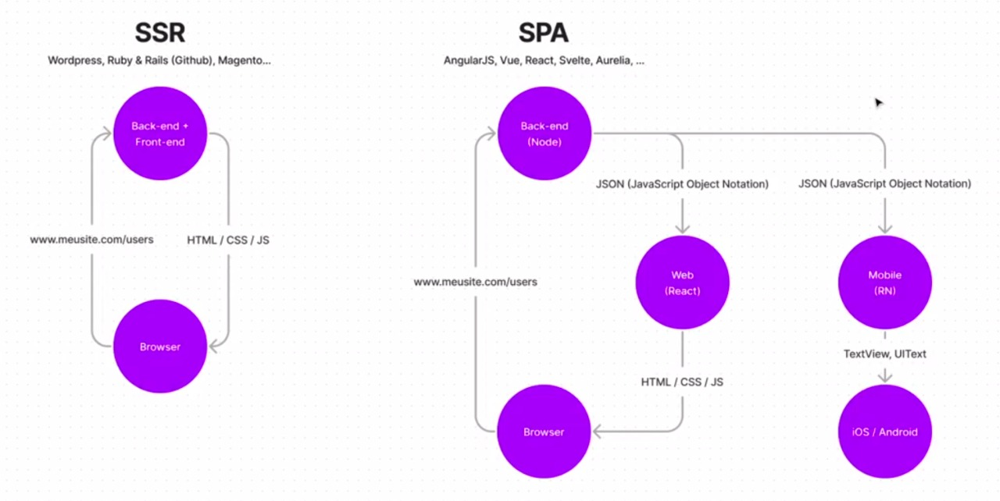
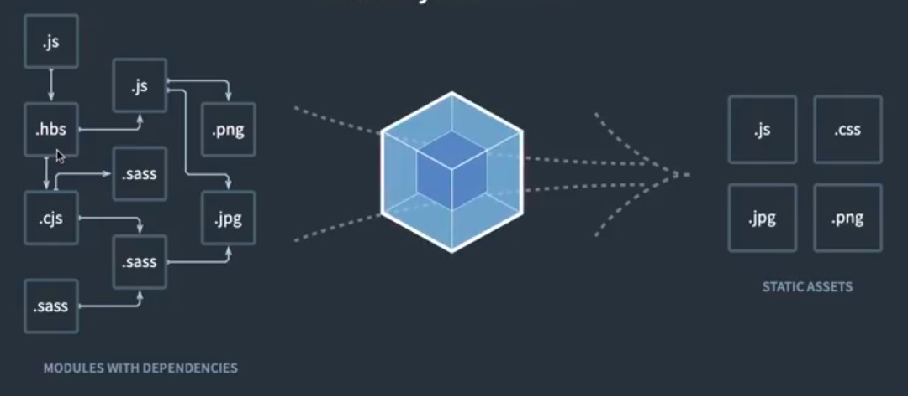

<h1>Fundamentos do React</h1>
<h2>O que é o React</h2>

Uma biblioteca para construção de interfaces altamente interativas.

Web com React, mobile com ReactNative, apps para TV com ReactTV e realidade virtual com ReactVR.

Uma biblioteca que quando acoplada a outras bibliotecas que executam em ambientes diferentes que não só web, pode controlar interfaces de usuários em qualquer lugar

Não é um framework

<h3>Rendering Patterns</h3>
<ul>
<li>
<h3>SSR - Server Side Rendering</h3>

Toda vez que um usuário requisita uma página, essa página é recebida pelo servidor. Esse servidor contem tanto o Back-end quanto o Front-end da aplicação, o back-end por si só interpreta que o navegador está pedindo a rota de usuários, faz a busca no banco ed dados, cria todo HTML para mostrar aquilo que o usuário está pedindo e devolve tudo(HTML/CSS/JS) já pronto para o navegador carregar.

</li>
<li>
<h3>SPA - Single Page Application</h3>

Quando o browser tenta acessar uma rota, o Back-end busca no banco de dados as informações, porém o back-end não tem mais dentro dele no servidor, todas as instruções para a construção do HTML, CSS e JS, ou seja, o back-end não fica mais responsável pela construção visual da tela. 

As informações retornadas pelo Back-end deixam de ser retornadas em formato HTML como ocorria no SSR, elas passam a ser retornadas em formato JSON(JavaScript Object Notation), que é uma estrutura de dados, um formato disponibilizar(trafegar) dados entre duas fontes diferentes, que é uma estrutura universal. Praticamente todas linguagens são capazes de interpretar JSON. 

</li>
</ul>

<h1>Bundlers & Compilers</h1>

Nem sempre browsers suportam os códigos criados com o JavaScript mais atual. Por isso, surgiram ferramentas que convertem esse JavaScript mais moderno para versões específicas que rodam em cenários específicos que os browsers sejam capazes de entender.

<ul>
<li>
<h2>Compilers</h2>

Compiladores são feramentas que convertem um código em outro. Para esses cenários que criamos um código que o browser ainda não é capaz de entender.

O <b>Babel</b> é provavelmente o compilador mais famoso que temos hoje em dia, se falando de JavaScript.

</li>
<li>
<h2>Bundlers</h2>

Uma das coisas mais comuns quando trabalhando com aplicações em JavaScript, é querermos escrever vários arquivos ao invés de concentrar todo código em um arquivo só. Isso não é algo normalmente suportado nativamente pelos navegadores.

O <b>WebPack</b> é provavelmente o bundler mais famoso que temos hoje em dia, se falando de JavaScript. Ele junta todos os vários arquivos que temos dentro da nossa aplicação e converte para arquivos únicos.

</li>
</ul>

Porém, de uns tempos para cá, os browsers começaram a dar indícios de suporte para importação nativa de arquivos. Com isso, acabamos não dependendo mais do WebPack, o que é algo positivo, porque na maioria das vezes executar o WebPack demora.

Com isso, surgem ferramentas novas como o <b>ViteJS</b>, ou o <b>SnowPack</b>.

O <b>ViteJS</b>, em vantagem contra o <b>WebPack</b>, tem como fator o uso de ESM nativos, ou seja, não é necessário Bundling, que é o que teríamos como o WebPack. E ele também faz o processo de Compiling de forma automática, eliminando a necessidade do Babel.

<h1>Criando um projeto React</h1>

 O projeto será criado com o <b>ViteJS</b>, para isso é simples, preciamos instalar o node, de preferência na versão LTS mais recente, depois criar o projeto com:

<code>
npm create vite@latest
</code>

E responder as perguntas de acordo com o projeto que vamos criar.

O ViteJS já traz algumas configurações prontas, uma das mais interessantes é o fast refresh, que nada mais é do que alterarmos nossa aplicação e a mudança refletir automticamente no browser.

<h2>Como o Hello World do App.jsx está sendo exibido?</h2>

Temos na raiz do projeto o index.html, que é o primeiro arquivo carregado pela aplicação. A partir dele, que temos apenas dois elementos dentro do body:

<pre>

  body
    div id="root"/
    script type="module" src="/src/main.jsx"/
  /body
</pre>

Podemos ver que no elemento script ele seta o type de importação como module, que é o que pontou-se do ViteJS. E ele lê primeiramente o arquivo src/main.jsx

O arquivo src/main.jsx que constrói a lógica, importando <b>React</b> que é o core da aplicação e o <b>ReactDOM</b> que é a integração do core do React com a DOM(Document Object Model), que é a representação do nosso HTML através do JS.

O <b>ReactDOM</b> possui o um método <b>createRoot</b> que recebe um argumento, que define qual será o elemento raiz da página HTML, que no caso da nossa aplicação é a div com id="root" do index.html.

<pre>
import React from 'react'
import ReactDOM from 'react-dom/client'
import App from './App'

ReactDOM.createRoot(document.getElementById('root')).render(
  <React.StrictMode>
    App
  </React.StrictMode>
)
</pre>

E o que acontece é que o React irá criar o HTML, CSS e JS da aplicação, dentro desta div id="root". Ou seja, quando construímos uma SPA, toda a interface da aplicação é construída a partir do JavaScript. Ela não fica dentro do index.html e sim dentro do JavaScript, facilitando com que seja manipulada

<h1>Componentes</h1>

É uma forma de desacoplar parte da nossa interface para que essa parte se torne repetitível ou algo mais fácil de dar manutenção por ser menor.

O componente, em seu conceito mais básico, é uma função que retorna HTML. Por isso a extensão .jsx(ou .tsx quando usarmos TypeScript), que é JavaScript + XML(HTML).

O componente não pode retornar mais de um elemento no mesmo nível hierárquico, todos eles precisam estar englobado dentro de um elemento final.

<h2>Default Exports vs Named Exports</h2>
<h3>Default Exports:</h3>

Você dá o nome para o componente na importação e não na exportação, por exemplo:

<pre>
function Post () {
    return (h1 Post h1)
}
export default Post
</pre>
<pre>
import PostComp from './Post'
function App () {
    return Post
}
</pre>
<h3>Named Exports:</h3>

Você dá o nome para o componente na exportação e não na importação, por exemplo:

<pre>
export function Post () {
    return (h1 Post h1)
}

</pre>
<pre>
import { Post } from './Post'
function App () {
    return Post
}
</pre>

<h1>Propriedades</h1>

São as informações que podemos passar de um componente para outro. O que no contexto do HTML temos como atributos, como a src da tag img, no contexto de componentes do React chamamos de propriedades.

Por exemplo, considerando o contexto de um blog coletivo, podemos ter várias postagens de autores diferentes, então o autor seria uma propriedade do post que recebe o valor referente ao autor daquele post.

<pre>
export function Post (autor) {
    return (
        div
            h1 Post h1
            p {autor} p
        div
    )
}
</pre>
<pre>
import { Post } from './Post'
function App () {
    return (
        div
            Post autor="Thiago"
            Post autor="Diego"
            Post autor="Mayk"
        div
    )
}
</pre>