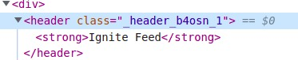

<h1>CSS Modules</h1>

No React nós não fazemos nenhuma importação de CSS pelo index.html. Todas importações partem do JavaScript.

O próprio ViteJS possui suporte nativo para o CSS Modules.

<h3>Escopo</h3>

Em CSS no React, é muito comum trabalharmos na ideia de escopo de componente. Isso quer dizer que, na maioria das vezes, quando aplicamos uma estilização a um determinado componente, não queremos que isso reflita em outros cenários da aplicação.

<h2>Utilizando na prática</h2>

Quando trabalhamos com CSS Modules, tentamos, na maioria das vezes, utilizar somente classes, não IDs ou outros tipos de seleção.

No React, não usamos o atributo class e sim o className para passar uma classe de estilos para um componente.

Quando usamos o CSS Modules, diferente de quando importamos um arquivo que não tem o module, precisamos dar um nome ao estilo, que será um objeto onde cada propriedade será o nome da classe que demos no nosso arquivo module.css:

<h4>Header.module.css</h4>
<pre>
.header {
    background-color: #333;
    height: 80px;
}
</pre>

<h4>Header.jsx</h4>
<pre>
import styles from './Header.module.css';
export function Header() {
    return (
        strong className={styles.header}>Ignite Feed /strong
    )
}
</pre>

Porém, como pode ser visto, ele gerou um nome diferente da classe que criamos. Isso ocorre por causa da questão de escopo do CSS Modules, gerando esse nome diferente, ele nos proporciona a possibilidade de usar em outros escopos componentes que possuam uma classe header que os estilos não irão conflitar, pois na geração do estilo, o nome da classe será diferente para ambos componentes.

<h1>CSS Global</h1>

CSS Global são os estilos que definimos por padrão para toda aplicação, é onde podemos resetar os estilos nativos do navegador como margin, padding, é onde podemos definir as variáveis de cores que usamos na aplicação, definir estilos gerais como background, font-family e qualquer outro estilo que se ache necessário e que não vai ficar escopado em algum componente específico.

Isso é feito através de um arquivo, normalmente chamado de global.css que fica junto na src e é importado pelo elemento mais alto na estrutura dos componentes, no caso da aplicação aqui, no App.jsx.
